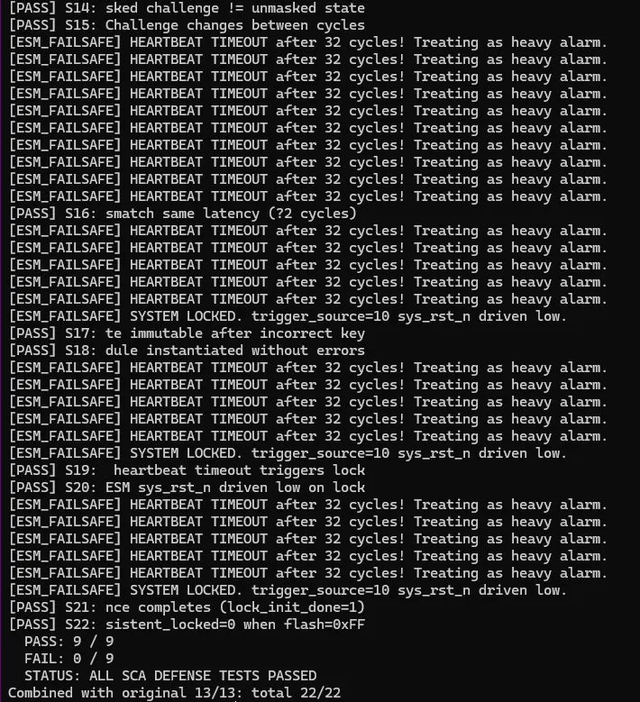
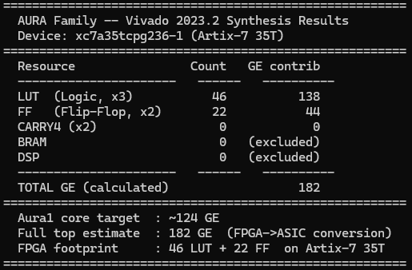
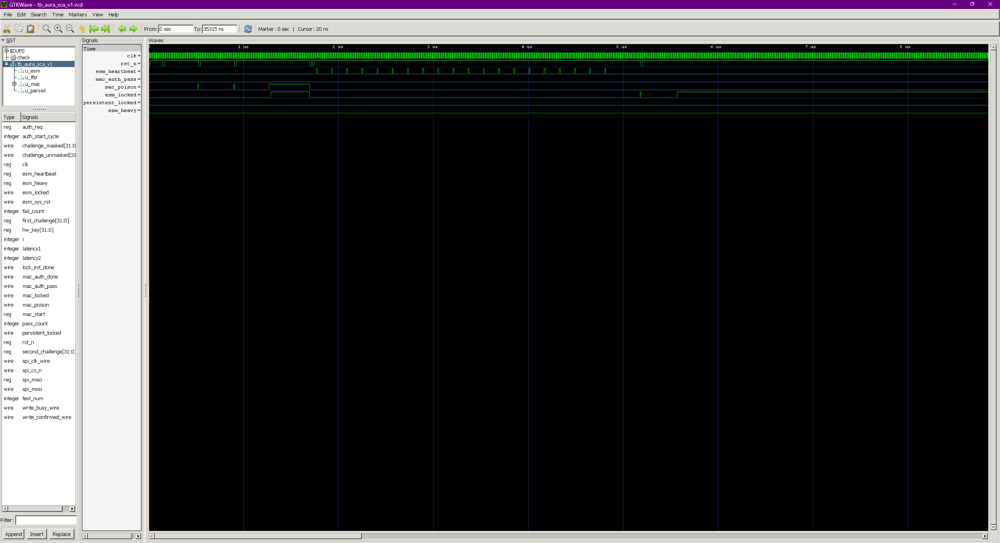

<div align="center">

# AURA — Raíz de Confianza Hardware

**182 GE · Defensa SCA de 4 capas · CMOS estándar / FPGA**

[](https://github.com/AgentLex/aura-public)
[](./docs/)
[](./docs/synthesis_report.png)

---

🌐 **Idioma / Language**

[English](./README.md) · [简体中文](./README.zh-CN.md) · [繁體中文](./README.zh-TW.md) · [日本語](./README.ja.md) · [Español](./README.es.md)

---

</div>

## El Problema

Las pérdidas anuales por clonación de chips ascienden a **$42.000 millones** en todo el mundo. La mayoría de los chips actuales autentican en el firmware — quien controla el software, controla la identidad del chip.

Las soluciones existentes no caben donde más se necesitan:

| Solución | Compuertas | Embebible en MCU/IoT | Anti-DPA | Anti-SEU |
|---|---|---|---|---|
| TPM 2.0 | ~50.000 GE | ✗ Demasiado grande | ✗ | ✗ |
| ARM TrustZone | Overhead SW | Parcial | ✗ | ✗ |
| PUF | ~10.000 GE | Parcial | ✗ | ✗ |
| **AURA** | **182 GE** | **✓ Totalmente compatible** | **✓ 4 capas** | **✓ L2 Dual-Rail** |

> Una implementación hardware de AES-128 requiere ~**2.400 GE**.  
> AURA entrega enlace de identidad + protección anti-clonación + defensa SCA de 4 capas en **182 GE** — el 7,6% del área de AES-128 solo.

---

## Mecanismo Central

Codificación de estados ternarios sobre CMOS binario estándar — **sin proceso especial requerido**.

```
2'b01  →  Legítimo · Pasa        Operación normal
2'b10  →  Aislado · Protegido    Acceso no autorizado bloqueado permanentemente;
                                  el propietario legítimo puede recuperar mediante credenciales
2'b11  →  Ilegal · Alerta        Anomalía detectada / Evento SEU
```

> **Clave:** Una vez que `2'b10` entra en la cadena MAC, ninguna instrucción de software puede borrarlo.  
> Es una restricción hardware — fundamentalmente diferente de una bandera firmware o un enum software.

---

## Defensa SCA de 4 Capas

| Capa | Mecanismo | Defiende Contra |
|---|---|---|
| L1 | LFSR enmascarado | DPA — eleva complejidad O(2³²) → O(2⁴⁸) |
| L2 | Lógica Dual-Rail | DPA + Inyección de fallos + SEU (detección en 0 ciclos) |
| L3 | MAC de tiempo constante | Canal lateral de temporización |
| L4 | Inserción de retardo aleatorio | Alineación de trazas DPA (~100× más difícil) |

Las 4 capas operan completamente en RTL — **sin dependencia de firmware**.

---

## Cifras Clave

| Métrica | Valor |
|---|---|
| Conteo de compuertas | **182 GE** (Vivado 2023.2, Artix-7 35T: 46 LUT + 22 FF) |
| Estimación ASIC | ~300–500 GE en 28nm |
| Área de silicio | **< 0,002 mm²** @28nm |
| Coste adicional por chip | **< $0,01** |
| Consumo de energía | **< 1 mW** (vs. TPM 2.0: 5–15 mW) |
| Simulación | **22/22 escenarios PASS** (Icarus Verilog) |
| Módulos RTL | 9 completos |

---

## Validación

<div align="center">


*22/22 escenarios de simulación — Verificación completa con Icarus Verilog*


*Síntesis Vivado 2023.2 en Xilinx Artix-7 35T: 46 LUT + 22 FF = 182 GE*


*GTKWave: Escenarios S1–S6 — Coincidencia total / Desviación leve / Media / Grave / Inyección de fallos / Recuperación*

</div>

---

## Casos de Uso

**Cerraduras inteligentes / IoT de alta seguridad**  
182 GE cabe en cualquier MCU de cerradura. EN 18031 de la UE obligatorio desde agosto de 2025. Compatible con certificación SESIP L2.

**Automoción / ASIL-D / ISO 21434**  
La defensa SCA de 4 capas cumple los requisitos hardware de ISO 21434. Penalización de área en silicio ECU: < 0,002 mm².

**Controladores industriales / Electrónica de defensa**  
Versión FPGA disponible hoy. El enlace de identidad previene la falsificación en la cadena de suministro.

---

## Cómo Empezar

AURA está disponible para evaluación técnica bajo NDA.

**Evaluación FPGA (Artix-7 / Basys 3)**
```
Contáctenos → Firme NDA → Reciba FPGA Starter Kit:
Definiciones de interfaz RTL + documentación de integración + scripts de simulación
Evaluación típica: 2–4 semanas
```

**Integración ASIC**
```
Contacte 3–6 meses antes del tape-out
Paquete RTL completo + restricciones de síntesis + informes de temporización bajo NDA
Documentación para certificación SESIP L2 / ISO 21434 incluida
```

---

## Propiedad Intelectual

- 🇨🇳 **Patente de invención china** — Solicitud N.º 2026106956971 (presentada mayo 2026)
- 🌍 **Solicitud PCT en 5 países** en curso — CN / EE.UU. / UE / JP / KR

---

## Contacto

**Shanghai Opti Aura Technology Co., Ltd. / OptiAura Tech**

📩 lexxu@optiaura.tech  
🌐 optiaura.tech  
👤 [Lex Xu en LinkedIn](https://www.linkedin.com/in/lex-xu-optiaura/)

> *Revisión completa del código RTL disponible tras firma de NDA. Soporte de ingenieros de integración incluido.*
