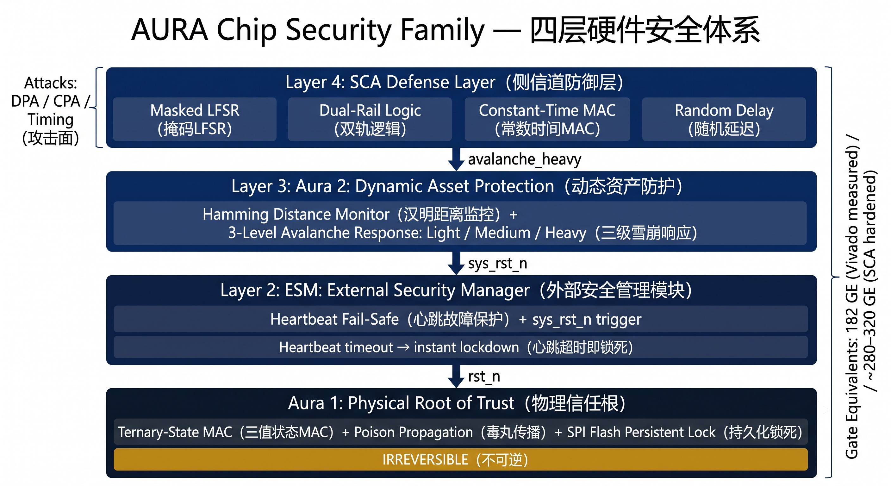
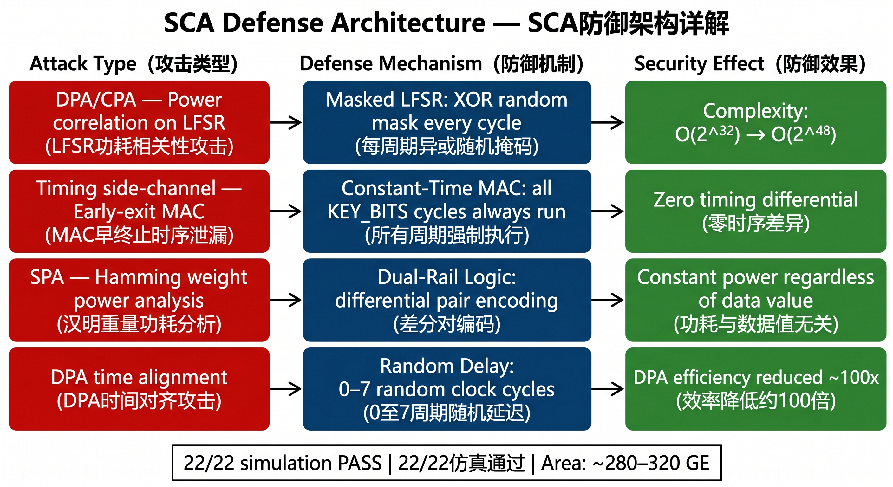
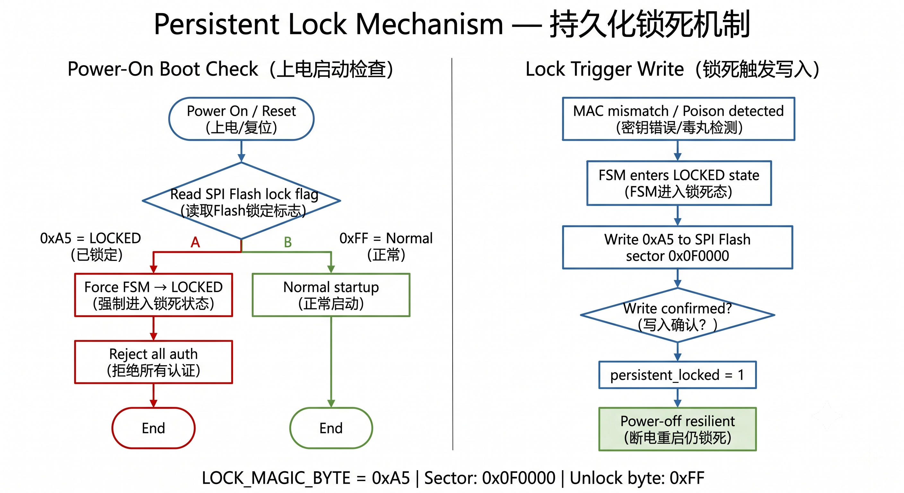
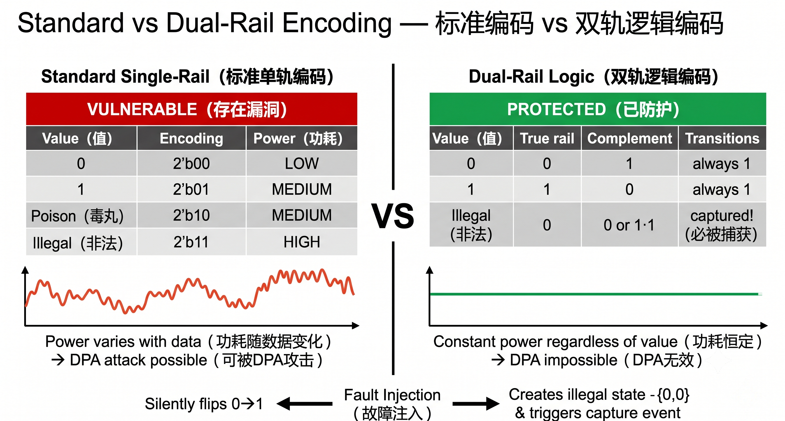

<div align="center">

# AURA — 硬體信任根

**182 GE（Base）· ~300 GE SCA加固版 · 四層側信道防禦 · 標準CMOS / FPGA**

[](https://github.com/AgentLex/aura-public)
[](./docs/)
[](./docs/synthesis_report.png)
[](./docs/arch_system_overview.png)

---

🌐 **語言切換**

[English](./README.md) · [简体中文](./README.zh-CN.md) · [繁體中文](./README.zh-TW.md) · [日本語](./README.ja.md) · [Español](./README.es.md)

---

</div>

## 產業痛點

全球晶片仿冒每年造成約 **$420億** 損失。絕大多數晶片的身份認證邏輯在韌體層——任何控制了軟體的人，也就控制了晶片身份。

現有方案在最需要安全的場景裡根本放不進去：

| 方案 | 閘等效數 | 可嵌入MCU/IoT | 抗DPA側信道 | 防SEU |
|---|---|---|---|---|
| TPM 2.0 | ~50,000 GE | ✗ 太大 | ✗ | ✗ |
| ARM TrustZone | 軟體開銷 | 部分 | ✗ | ✗ |
| PUF | ~10,000 GE | 部分 | ✗ | ✗ |
| **AURA（Base）** | **182 GE** | **✓ 完全相容** | **✓ 四層防禦** | **✓ L2雙軌邏輯** |
| **AURA（SCA加固版）** | **~280–320 GE** | **✓ 完全相容** | **✓ 四層全激活** | **✓ L2雙軌邏輯** |

> **閘數說明：** 182 GE = Base HRoT（FPGA實測：46 LUT + 22 FF）。~280–320 GE = 四層SCA全部激活（FPGA）。ASIC @ 28nm 估算約300–500 GE。

---

## 核心機制

在標準二進位CMOS上實現三值狀態編碼，**無需特殊製程**。

```
2'b01 → 合法 · 通過   正常運作
2'b10 → 隔離 · 保護   非授權存取永遠無法通過；合法所有者可憑證申請恢復
2'b11 → 非法 · 告警   偵測到異常 / SEU事件
```

> **關鍵**：`2'b10` 一旦注入MAC鏈，任何軟體指令均無法清除。
> 這是硬體編碼約束，與韌體旗標或軟體enum有本質區別。

---

## 四層側信道防禦

| 層級 | 機制 | 防禦目標 |
|---|---|---|
| L1 | 遮罩LFSR | DPA — 攻擊複雜度 O(2³²) → O(2⁴⁸) |
| L2 | 雙軌邏輯 | DPA + 故障注入 + SEU（0週期偵測） |
| L3 | 常數時間MAC | 時序側信道洩漏 |
| L4 | 隨機延遲插入 | DPA軌跡對齊（難度提升約100倍） |

全部四層均在RTL層面實現，**無需韌體支援**。

---

## 關鍵數據

| 指標 | 數值 |
|---|---|
| 邏輯面積 — Base HRoT（FPGA） | **182 GE**（Vivado 2023.2，Artix-7 35T：46 LUT + 22 FF）|
| 邏輯面積 — SCA加固版（FPGA） | **~280–320 GE**（四層SCA全部激活） |
| ASIC估算 @ 28nm | **~300–500 GE**（SCA加固版） |
| 矽晶面積 @ 28nm | **< 0.003 mm²**（SCA加固版） |
| 單片成本增加 | **< ¥0.1 / 片** |
| 功耗 | **< 1 mW**（TPM 2.0 為 5–15 mW）|
| 模擬驗證 | **22/22 場景全PASS**（Icarus Verilog）|
| RTL模組 | 9個完成 |

---

## 驗證數據

<div align="center">


*22/22 模擬場景全PASS — Icarus Verilog 全棧驗證*


*Vivado 2023.2：Artix-7 35T，46 LUT + 22 FF = 182 GE（Base HRoT）*


*GTKWave：S1–S6 核心場景*

</div>

---

## 架構圖解

<div align="center">


*四層主動防護體系：SCA防禦層 → Aura 2（感知）→ ESM（決策）→ Aura 1（執行 / 信任根）*


*攻擊類型 → 防禦機制 → 防禦效果，4層SCA全映射*


*上電啟動偵測 + 鎖死觸發寫入流程——鎖死狀態斷電重啟仍保持*


*標準單軌（功耗隨資料變化 = DPA可攻擊）vs 雙軌邏輯（功耗恆定 = DPA無效）*

</div>

---

## 演示影片

*FPGA實機錄製（Artix-7 35T）——影片將上傳至 GitHub Releases，⭐ Star 本倉庫以獲取通知。*

| # | 場景 | 說明 | 連結 |
|---|---|---|---|
| 01 | 正常認證 | 正確憑證 → 認證通過 | 🔜 即將上傳 |
| 02 | 暴力破解 → 鎖死 | 3次失敗 → 不可逆硬體鎖死 | 🔜 即將上傳 |
| 03 | 斷電持久鎖死 | 鎖死狀態在斷電重啟後仍保持 | 🔜 即將上傳 |
| 04 | 授權解鎖恢復 | 合法憑證 → 恢復正常運行 | 🔜 即將上傳 |
| 05 | 重放攻擊攔截 | 重用令牌 → 偵測並拒絕 | 🔜 即將上傳 |
| 06 | 權限跳躍攔截 | 未授權狀態跳躍 → 硬體屏障 | 🔜 即將上傳 |
| 00 | 完整演示 | 全部7個場景完整演示 | 🔜 即將上傳 |

---

## 知識產權

- 🇨🇳 **中國發明專利** — 申請號 **202610850983.0**（2026年申請）
- 🇨🇳 **中國發明專利** — 申請號 **2026106956971**（2026年5月申請）
- 🌍 **PCT五國佈局** 進行中 — 中 / 美 / 歐 / 日 / 韓

> 完整RTL源碼、綜合約束與IP授權條款在NDA簽署後提供。

---

## 聯絡方式

**OptiAura Tech — 超矩陣（上海）高科技有限公司**

📩 lexxu@optiaura.tech
🌐 optiaura.tech
👤 [Lex Xu on LinkedIn](https://www.linkedin.com/in/lex-xu-optiaura/)

> *完整RTL代碼在NDA簽署後提供審閱，全程技術對接支援。*
